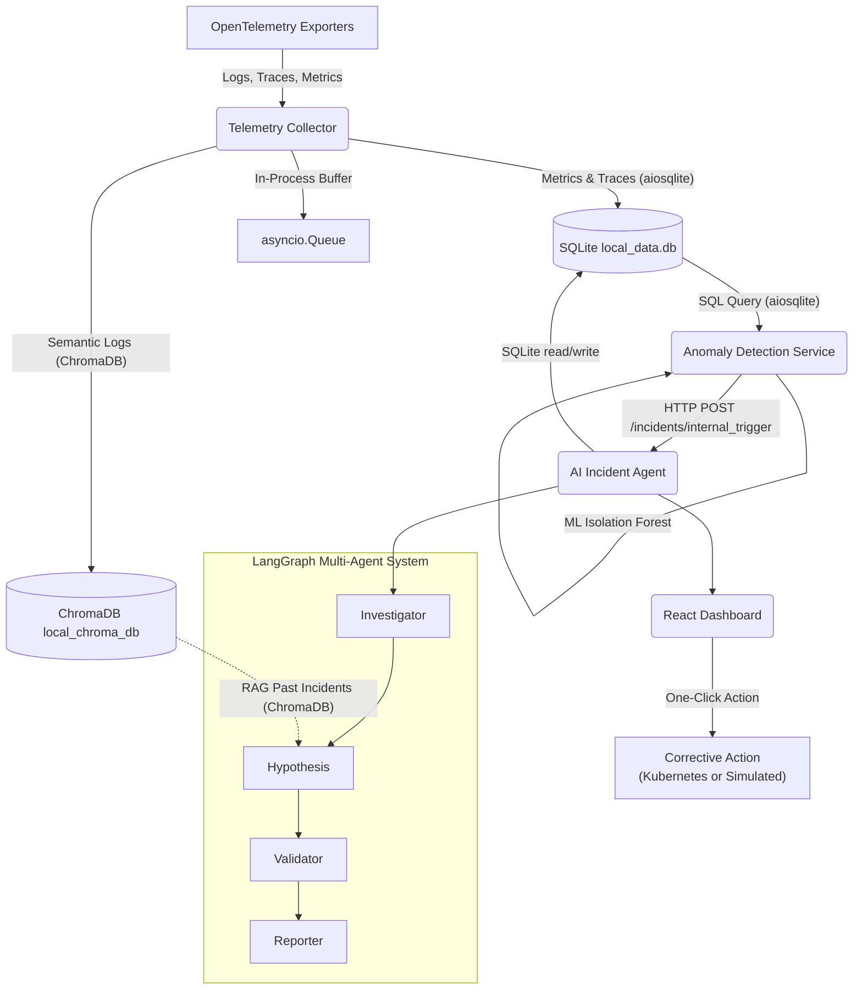
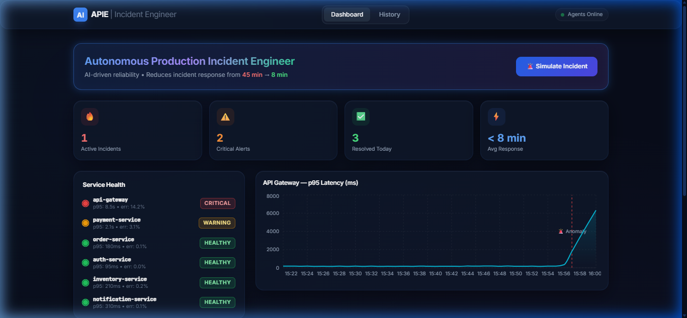
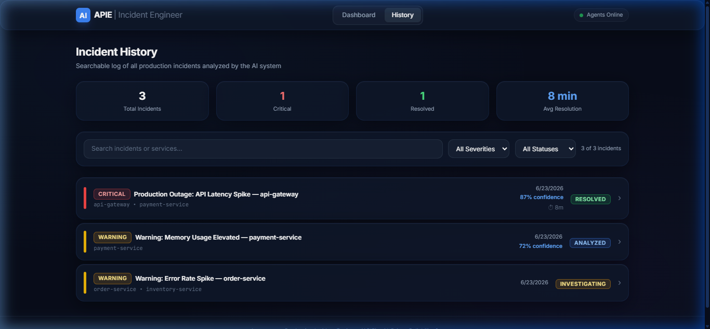
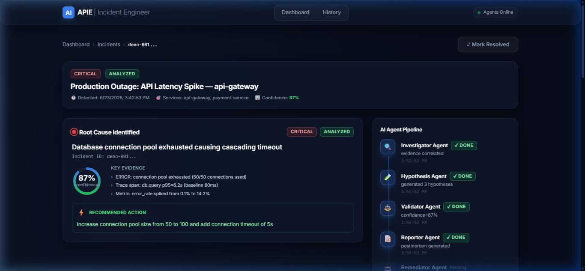

# Autonomous Production Incident Engineer 🚨🤖

An AI-driven reliability system that automatically investigates and diagnoses production system failures. Reduces incident response time from 45+ minutes to under 8 minutes.

[](.github/workflows/ci.yml)
[](#)
[](#)

## Problem Statement
When production systems fail, SREs spend an average of 45 minutes correlating logs, tracing errors, querying metrics, and building a mental model of the failure before taking action. **This platform automates that entire process**, bringing MTTR (Mean Time to Resolution) down to under 8 minutes through autonomous multi-agent analysis and one-click corrective actions.

## Tech Stack

* **Backend:** Python 3.11, FastAPI, LangGraph, LangChain, scikit-learn
* **Databases:** SQLite (metrics + incidents, zero-install), ChromaDB (vector RAG, zero-install)
* **Messaging:** Python `asyncio.Queue` (zero-install in-process buffer)
* **Frontend:** React 18, TypeScript, Tailwind CSS, Recharts, Material-UI
* **Infrastructure:** Runs fully natively on Windows — no Docker, no external databases

## Architecture Diagram



## Features

1. **Real-Time Anomaly Detection**: scikit-learn Isolation Forest models detect multivariate deviations (latency, errors, CPU, memory) continuously — seeded with synthetic baselines on startup.
2. **Multi-Source Evidence Correlation**: Automatically pulls logs, distributed traces, and metrics into a unified temporal window.
3. **Root Cause Hypothesis Generation**: LLM-driven generation of top 3 probable root causes based on correlated evidence.
4. **Confidence Validation**: Automated cross-checking of hypotheses against trace timings and log patterns to score confidence.
5. **Auto-Generated Incident Reports**: Professional postmortem generation with citations to underlying data.
6. **One-Click Corrective Actions**: Directly execute K8s commands (e.g., restart service, scale up, flush cache) from the dashboard.
7. **Historical Incident Knowledge Base**: RAG (Retrieval-Augmented Generation) uses local ChromaDB to learn from past resolved incidents and suggest proven fixes.

## Quick Start (Zero-Infrastructure Local Run)

The application runs entirely natively on Windows with **zero external software dependencies**. It uses lightweight, embedded databases:
- **SQLite**: Stores metrics, traces, and incident metadata locally (`local_data.db`).
- **ChromaDB**: Runs vector embeddings for logs and incident history (`local_chroma_db`).
- **Python `asyncio.Queue`**: Buffers incoming metrics natively.

To run the application:

1. Configure your Groq API key in the `.env` file in the root folder.
2. Execute the PowerShell runner script. This will install all Python and Node.js dependencies and launch all 4 services natively:
   ```powershell
   .\scripts\run_all_native.ps1
   ```

## API Documentation

The platform exposes two primary APIs:
- **Telemetry API**: [http://localhost:8001/docs](http://localhost:8001/docs) (OTLP ingestion and querying)
- **AI Agent API**: [http://localhost:8000/docs](http://localhost:8000/docs) (Incident orchestration and WebSocket feed)

## Evaluation Metrics

This project uses CI-gated evaluation to ensure the AI's diagnostic accuracy meets production standards:
- **Detection Accuracy**: Precision > 90%, Recall > 85%
- **Root Cause Accuracy**: Top-1 hypothesis matches actual root cause > 70%
- **Confidence Calibration**: High confidence (80+) hypotheses are correct > 85%
- **Response Time**: Full analysis completes within 3 minutes of anomaly detection

*(Run tests locally with `pytest tests/ -v`)*

## Dashboard Screenshots

Here are screenshots of the autonomous incident dashboard interfaces:

### 1. Main Dashboard (Real-time Service Health & Anomaly Feed)


### 2. Incident History (Searchable logs & audit trails)


### 3. AI Incident Agent Analysis (Root Cause Hypotheses, Supporting Evidence & Action Execution)



## - By Swarnadipta Das

B.Tech | CSE(AI & ML) 
